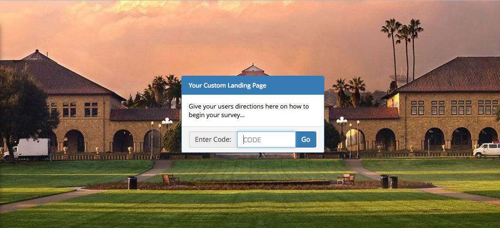

# REDCap module: Custom Survey Landing Page
This REDCap module creates a new landing page that can be used for manual survey code entry (e.g. when sending an email invitation or snail mail invitation, or when bookmarking a landing page on a table for kiosk use.)

## Prerequisites
- REDCap >= 8.0.3 (for versions < 8.0.3, [REDCap Modules](https://github.com/vanderbilt/redcap-external-modules) is required).

## Easy Installation
- Obtain this module from the Consortium [REDCap Repo](https://redcap.vanderbilt.edu/consortium/modules/index.php) from the control center.
- Optionally make it discoverable by all users

## Features included
- Customize the title, body, and input settings
- Set a custom image in the background

## Acknowledgements
This module was built by Andy Martin and Jae Lee of Stanford University.
